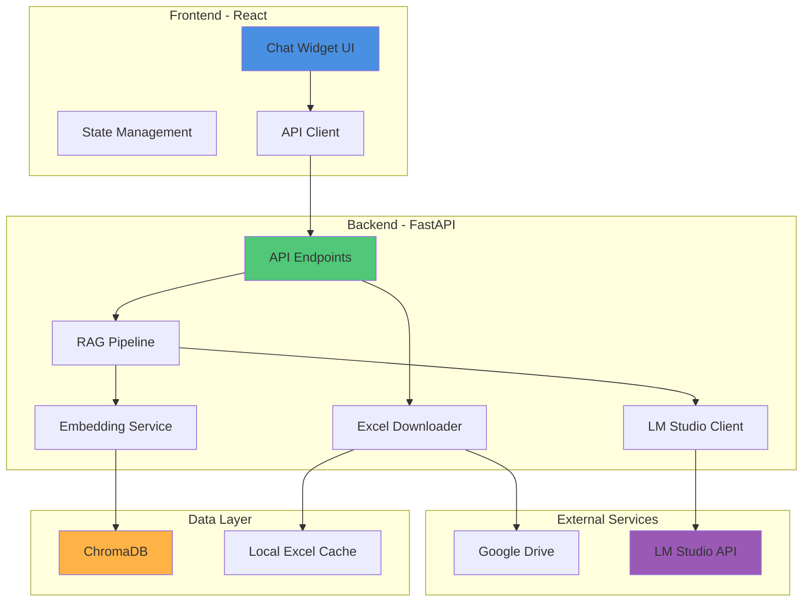
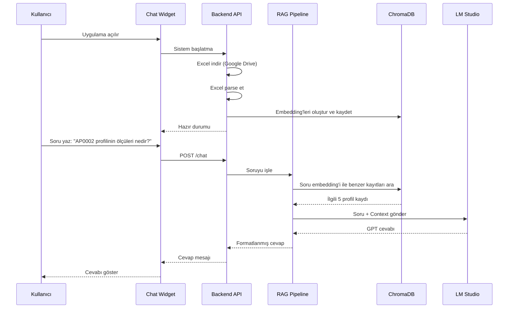

# Tasarım Dokümanı

## Genel Bakış

LM Studio Chat Integration, Beymetal Alüminyum profil kataloğu için RAG (Retrieval-Augmented Generation) tabanlı akıllı sohbet sistemidir. Sistem, Google Drive'dan profil verilerini otomatik indirip embedding teknolojisi ile vektörleştirir ve kullanıcıların yerel GPT modeli ile doğal dilde profil bilgilerini sorgulamasına olanak tanır.

### Temel Bileşenler
- **Frontend**: Modern, animasyonlu chat widget (React)
- **Backend**: Python FastAPI servisi (embedding, RAG pipeline, LM Studio entegrasyonu)
- **Vector Database**: ChromaDB (yerel, kolay kurulum)
- **LM Studio**: Yerel GPT model sunucusu (kullanıcının bilgisayarında)

## Mimari

### Sistem Mimarisi



### Veri Akışı



## Bileşenler ve Arayüzler

### 1. Frontend - Chat Widget (React)

#### Bileşen Yapısı
```
src/
├── components/
│   ├── ChatWidget/
│   │   ├── ChatWidget.tsx          # Ana widget container
│   │   ├── ChatHeader.tsx          # Başlık ve minimize butonu
│   │   ├── MessageList.tsx         # Mesaj geçmişi
│   │   ├── MessageBubble.tsx       # Tek mesaj bileşeni
│   │   ├── ChatInput.tsx           # Input alanı ve gönder butonu
│   │   └── ChatWidget.css          # Animasyonlar ve stil
│   └── LoadingIndicator.tsx        # Yükleme animasyonu
├── services/
│   └── chatApi.ts                  # Backend API client
├── hooks/
│   ├── useChat.ts                  # Chat state management
│   └── useLocalStorage.ts          # Sohbet geçmişi yönetimi
└── types/
    └── chat.ts                     # TypeScript tipleri
```

#### Tasarım Özellikleri
- **Konum**: Sol alt köşe (fixed position)
- **Boyutlar**: 
  - Minimize: 60px x 60px (yuvarlak buton)
  - Açık: 400px x 600px
- **Renkler**: Beymetal mavi tonları (#4A90E2, #2E5C8A)
- **Animasyonlar**:
  - Açılma/kapanma: scale + fade (300ms ease-in-out)
  - Mesaj gelişi: slide-up + fade (200ms)
  - Typing indicator: pulse animasyonu

#### API Client Interface
```typescript
interface ChatMessage {
  id: string;
  role: 'user' | 'assistant';
  content: string;
  timestamp: number;
}

interface ChatResponse {
  message: string;
  context: ProfileContext[];
  processingTime: number;
}

interface ProfileContext {
  code: string;
  category: string;
  dimensions: Record<string, number>;
}
```

### 2. Backend - FastAPI Service

#### API Endpoints

**POST /api/chat**
```python
Request:
{
  "message": "AP0002 profilinin ölçüleri nedir?",
  "conversation_history": [...]  # Opsiyonel
}

Response:
{
  "message": "AP0002 profili bir STANDART BORU'dur. Ölçüleri: Ø=28.0mm, K=1.0mm",
  "context": [
    {
      "code": "AP0002",
      "category": "STANDART BORU",
      "dimensions": {"Ø": 28.0, "K": 1.0}
    }
  ],
  "processing_time": 1.23
}
```

**GET /api/health**
```python
Response:
{
  "status": "healthy",
  "lm_studio_connected": true,
  "vector_db_ready": true,
  "profiles_count": 92
}
```

**POST /api/refresh-data**
```python
Response:
{
  "status": "success",
  "profiles_updated": 92,
  "last_update": "2025-10-23T10:30:00Z"
}
```

#### Servis Yapısı
```
backend/
├── main.py                    # FastAPI app
├── config.py                  # Yapılandırma
├── services/
│   ├── excel_service.py       # Google Drive indirme ve parse
│   ├── embedding_service.py   # Embedding oluşturma
│   ├── rag_service.py         # RAG pipeline
│   └── lm_studio_client.py    # LM Studio API client
├── models/
│   ├── profile.py             # Profil veri modeli
│   └── chat.py                # Chat request/response modelleri
└── utils/
    ├── excel_parser.py        # Excel parsing logic
    └── text_formatter.py      # Profil → text dönüşümü
```

### 3. Excel Service

#### Excel Parsing Stratejisi

Standart.xlsx dosyası 6 kategori içerir ve her kategori farklı kolonlarda:

```python
CATEGORY_COLUMNS = {
    "STANDART BORU": {
        "code_col": 0,
        "dimensions": {"Ø": 1, "K": 2}
    },
    "STANDART KUTU": {
        "code_col": 4,
        "dimensions": {"A": 5, "B": 6, "K": 7}
    },
    "STANDART T": {
        "code_col": 8,
        "dimensions": {"A": 9, "B": 10, "K": 11}
    },
    "STANDART U": {
        "code_col": 12,
        "dimensions": {"A": 13, "B": 14, "K": 15}
    },
    "STANDART LAMA": {
        "code_col": 16,
        "dimensions": {"A": 17, "B": 18}
    },
    "STANDART KÖŞEBENT": {
        "code_col": 20,
        "dimensions": {"A": 21, "B": 22, "K": 23}
    }
}
```

#### Text Formatı
Her profil şu formatta text'e dönüştürülür:
```
Profil Kodu: AP0002
Kategori: STANDART BORU
Ölçüler: Ø=28.0mm, K=1.0mm
Açıklama: Bu profil standart boru kategorisinde, 28mm çapında ve 1mm kalınlığında bir alüminyum profildir.
```

### 4. Embedding Service

#### Embedding Modeli
- **Model**: sentence-transformers/paraphrase-multilingual-MiniLM-L12-v2
- **Boyut**: 384 dimensions
- **Dil**: Türkçe destekli
- **Hız**: ~50ms per embedding

#### ChromaDB Koleksiyonu
```python
collection_config = {
    "name": "beymetal_profiles",
    "metadata": {
        "description": "Beymetal profil kataloğu embeddings",
        "version": "1.0"
    },
    "embedding_function": SentenceTransformerEmbeddingFunction(
        model_name="paraphrase-multilingual-MiniLM-L12-v2"
    )
}
```

#### Veri Yapısı
```python
{
    "id": "AP0002",
    "embedding": [0.123, -0.456, ...],  # 384 boyutlu vektör
    "metadata": {
        "code": "AP0002",
        "category": "STANDART BORU",
        "dimensions": {"Ø": 28.0, "K": 1.0},
        "text": "Profil Kodu: AP0002..."
    }
}
```

### 5. RAG Pipeline

#### İşlem Adımları

1. **Soru Embedding**
   - Kullanıcı sorusunu embedding'e çevir
   - Normalize et

2. **Benzerlik Araması**
   - ChromaDB'de cosine similarity ile en yakın 5 kaydı bul
   - Threshold: 0.6 (daha düşük skorları filtrele)

3. **Context Oluşturma**
   ```python
   context_template = """
   İlgili Profiller:
   
   1. {profile_1_text}
   2. {profile_2_text}
   ...
   
   Kullanıcı Sorusu: {user_question}
   
   Lütfen yukarıdaki profil bilgilerini kullanarak kullanıcının sorusunu Türkçe olarak cevapla.
   """
   ```

4. **LM Studio'ya Gönderme**
   - System prompt + context + soru
   - Temperature: 0.7
   - Max tokens: 500

### 6. LM Studio Client

#### API Entegrasyonu
```python
class LMStudioClient:
    def __init__(self, base_url="http://localhost:1234"):
        self.base_url = base_url
        self.endpoint = f"{base_url}/v1/chat/completions"
    
    async def generate_response(
        self,
        messages: List[Dict],
        temperature: float = 0.7,
        max_tokens: int = 500
    ) -> str:
        payload = {
            "messages": messages,
            "temperature": temperature,
            "max_tokens": max_tokens,
            "stream": False
        }
        # OpenAI-compatible API call
        ...
```

#### Hata Yönetimi
- Connection timeout: 10 saniye
- Retry logic: 3 deneme, exponential backoff
- Fallback mesajı: "LM Studio'ya bağlanılamıyor. Lütfen LM Studio'nun çalıştığından emin olun."

## Veri Modelleri

### Profile Model
```python
from pydantic import BaseModel
from typing import Dict, Optional

class Profile(BaseModel):
    code: str
    category: str
    dimensions: Dict[str, float]
    text_representation: str
    
    def to_embedding_text(self) -> str:
        dims = ", ".join([f"{k}={v}mm" for k, v in self.dimensions.items()])
        return f"Profil Kodu: {self.code}\nKategori: {self.category}\nÖlçüler: {dims}"
```

### Chat Models
```python
class ChatRequest(BaseModel):
    message: str
    conversation_history: Optional[List[Dict]] = []

class ChatResponse(BaseModel):
    message: str
    context: List[Dict]
    processing_time: float
```

## Hata Yönetimi

### Frontend Hataları
1. **API Bağlantı Hatası**
   - Kullanıcıya: "Sunucuya bağlanılamıyor. Lütfen tekrar deneyin."
   - Retry butonu göster

2. **Timeout**
   - 30 saniye sonra timeout
   - "İstek zaman aşımına uğradı" mesajı

3. **Geçersiz Yanıt**
   - JSON parse hatası
   - "Beklenmeyen bir hata oluştu" mesajı

### Backend Hataları
1. **Google Drive İndirme Hatası**
   - Yerel cache'i kullan
   - Log: "Drive download failed, using cached version"

2. **LM Studio Bağlantı Hatası**
   - Kullanıcıya bilgi ver
   - HTTP 503: "LM Studio is not available"

3. **Embedding Hatası**
   - Fallback: Basit keyword search
   - Log error ve devam et

4. **ChromaDB Hatası**
   - Sistem başlatılamaz
   - HTTP 500: "Vector database initialization failed"

## Test Stratejisi

### Unit Tests
- Excel parser: Tüm 6 kategori için doğru parse
- Text formatter: Profil → text dönüşümü
- Embedding service: Model yükleme ve embedding oluşturma
- RAG pipeline: Context oluşturma logic

### Integration Tests
- API endpoints: Request/response validation
- ChromaDB: Insert, query, update operations
- LM Studio client: Mock API ile test

### E2E Tests
- Kullanıcı sorusu → Cevap akışı
- Excel güncelleme → Yeni embedding'ler
- Chat geçmişi: LocalStorage kaydetme/yükleme

### Performance Tests
- Embedding oluşturma: <100ms per profile
- RAG query: <2 saniye total
- Chat widget animasyonları: 60fps

## Güvenlik ve Performans

### Güvenlik
- API rate limiting: 10 request/dakika per IP
- Input sanitization: XSS koruması
- CORS: Sadece frontend domain'i
- Secrets: Environment variables (.env)

### Performans Optimizasyonları
- Embedding cache: Aynı soru için tekrar hesaplama
- Lazy loading: Chat widget sadece gerektiğinde yükle
- Debouncing: Typing indicator için 300ms
- Connection pooling: LM Studio için persistent connection

### Ölçeklenebilirlik
- ChromaDB: 10,000+ profile destekler
- Batch embedding: 50 profile aynı anda
- Async operations: FastAPI async endpoints
- Frontend: React.memo ile gereksiz render'ları önle
