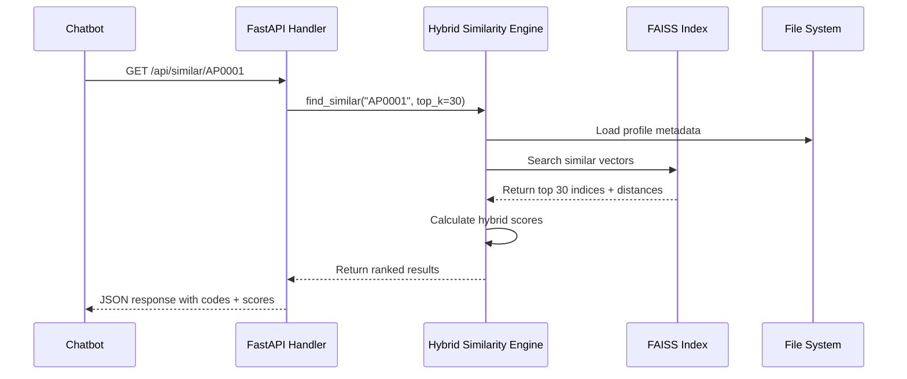
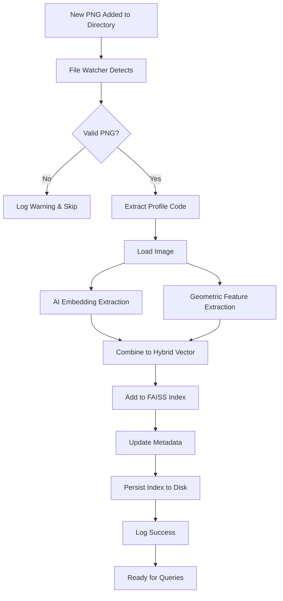

# Design Document

## Overview

The Aluminum Profile Similarity Search System is a hybrid AI-powered web service that enables fast and accurate similarity search across 3,610 aluminum profile cross-section images. The system combines deep learning embeddings (ResNet50) with geometric shape descriptors to achieve high accuracy for profile matching. It exposes a RESTful API for integration with external chatbot systems.

### Key Design Principles

- **Performance First**: Pre-compute all embeddings and features during initialization for sub-500ms query response times
- **Hybrid Approach**: Combine AI (70%) and geometric features (30%) for optimal accuracy on technical drawings
- **Scalability**: Use FAISS for efficient similarity search that can scale to millions of profiles
- **Reliability**: Graceful error handling and comprehensive logging
- **Configurability**: Environment-based configuration for flexible deployment

## Architecture

### High-Level Architecture

```
┌─────────────────┐
│   Chatbot API   │
└────────┬────────┘
         │ HTTP GET /api/similar/{code}
         ▼
┌─────────────────────────────────────────┐
│         FastAPI Web Service             │
│  ┌───────────────────────────────────┐  │
│  │     Similarity Search Handler     │  │
│  └───────────┬───────────────────────┘  │
│              │                           │
│  ┌───────────▼───────────────────────┐  │
│  │    Hybrid Similarity Engine       │  │
│  │  ┌─────────────┬────────────────┐ │  │
│  │  │ AI Embedder │ Geo Extractor  │ │  │
│  │  │  (ResNet50) │  (OpenCV)      │ │  │
│  │  └─────────────┴────────────────┘ │  │
│  └───────────┬───────────────────────┘  │
│              │                           │
│  ┌───────────▼───────────────────────┐  │
│  │      FAISS Vector Index           │  │
│  │    (3,610 profile vectors)        │  │
│  └───────────────────────────────────┘  │
└─────────────────────────────────────────┘
         │
         ▼
┌─────────────────────────────────────────┐
│       File System Storage               │
│  • Profile Images (PNG)                 │
│  • FAISS Index (binary)                 │
│  • Profile Metadata (JSON)              │
└─────────────────────────────────────────┘
```

### Component Interaction Flow



## Components and Interfaces

### 1. FastAPI Web Service

**Responsibility**: HTTP API layer, request validation, response formatting

**Endpoints**:
```python
GET /api/similar/{profile_code}
  Parameters:
    - profile_code: str (path parameter)
    - top_k: int = 30 (query parameter, optional)
  Response:
    {
      "query_profile": "AP0001",
      "results": [
        {"profile_code": "AP0002", "similarity_score": 94.5},
        {"profile_code": "AP0015", "similarity_score": 92.3},
        ...
      ],
      "count": 30,
      "processing_time_ms": 145
    }
  Errors:
    - 404: Profile not found
    - 500: Internal server error

GET /health
  Response: {"status": "healthy", "indexed_profiles": 3610}

GET /docs
  Response: OpenAPI/Swagger documentation
```

**Dependencies**: FastAPI, Pydantic, uvicorn

### 2. Hybrid Similarity Engine

**Responsibility**: Core similarity computation combining AI and geometric features

**Class Structure**:
```python
class HybridSimilarityEngine:
    def __init__(self, config: Config):
        self.ai_embedder = AIEmbedder(model_name="resnet50")
        self.geo_extractor = GeometricFeatureExtractor()
        self.faiss_index = None
        self.profile_metadata = {}
        self.ai_weight = config.ai_weight  # 0.7
        self.geo_weight = config.geo_weight  # 0.3
    
    def initialize(self, image_dir: str):
        """Pre-process all images and build FAISS index"""
        pass
    
    def find_similar(self, profile_code: str, top_k: int = 30) -> List[SimilarityResult]:
        """Find top-k similar profiles"""
        pass
    
    def _compute_hybrid_vector(self, image: np.ndarray) -> np.ndarray:
        """Combine AI embedding + geometric features with inner contour amplification"""
        # Extract features
        ai_embedding = self.ai_embedder.extract_embedding(image)  # 2048 dims
        geo_features = self.geo_extractor.extract_features(image)  # 45 dims
        
        # Apply 3.0x amplification to inner contour features (indices 10-22)
        geo_features[10:23] *= 3.0
        
        # Apply weights
        ai_weighted = ai_embedding * self.ai_weight  # 70%
        geo_weighted = geo_features * self.geo_weight  # 30%
        
        # Concatenate
        return np.concatenate([ai_weighted, geo_weighted])
```

**Hybrid Vector Composition**:
- AI Embedding: 2048 dimensions (ResNet50 output)
- Geometric Features: 45 dimensions (normalized, including enhanced inner contour features)
- Inner Contour Amplification: 3.0x multiplier on inner contour features (13 features)
- Total: 2093 dimensions
- Weighted combination: 70% AI, 30% geometric (with inner contour amplification applied)

**Score Calibration**:
- Apply aggressive non-linear transformation to raw cosine similarity scores
- Use sigmoid-based calibration: `score = 100 / (1 + exp(-k * (distance - threshold)))`
- Use aggressive parameters: k >= 20.0, threshold >= 0.90
- Prevents score inflation and creates realistic distribution
- Ensures distinct profiles score below 60%
- Target average similarity score below 65%

### 3. AI Embedder (ResNet50)

**Responsibility**: Extract deep learning features from profile images

**Implementation**:
```python
class AIEmbedder:
    def __init__(self, model_name: str = "resnet50"):
        # Load pre-trained ResNet50
        self.model = torchvision.models.resnet50(pretrained=True)
        # Remove final FC layer
        self.model = torch.nn.Sequential(*list(self.model.children())[:-1])
        self.model.eval()
        
        # Image preprocessing
        self.transform = transforms.Compose([
            transforms.Resize(256),
            transforms.CenterCrop(224),
            transforms.ToTensor(),
            transforms.Normalize(
                mean=[0.485, 0.456, 0.406],
                std=[0.229, 0.224, 0.225]
            )
        ])
    
    def extract_embedding(self, image: np.ndarray) -> np.ndarray:
        """Extract 2048-dim embedding from image"""
        # Returns: (2048,) numpy array
        pass
```

**Model Details**:
- Pre-trained on ImageNet
- Input: 224x224 RGB images
- Output: 2048-dimensional feature vector
- Inference time: ~50-100ms on CPU, ~10-20ms on GPU

### 4. Geometric Feature Extractor

**Responsibility**: Extract shape-based features from profile images with emphasis on inner contour detection

**Features Extracted**:
1. **Outer Contour Features** (10 dims):
   - Largest contour area
   - Largest contour perimeter
   - Contour complexity (perimeter²/area)
   - Bounding box aspect ratio
   - Convex hull area ratio
   - Number of vertices (approximated)
   - Solidity (area/convex hull area)
   - Extent (area/bounding box area)
   - Circularity (4π×area/perimeter²)
   - Outer contour orientation

2. **Inner Contour Features** (13 dims) - **ENHANCED & AMPLIFIED**:
   - Number of inner contours (holes/cavities) - **AMPLIFIED 3.0x**
   - Total inner contour area (sum of all holes) - **AMPLIFIED 3.0x**
   - Largest inner contour area - **AMPLIFIED 3.0x**
   - Smallest inner contour area - **AMPLIFIED 3.0x**
   - Average inner contour area - **AMPLIFIED 3.0x**
   - Inner contour area ratio (total holes / outer area) - **AMPLIFIED 3.0x**
   - Inner contour count density (count / outer area) - **AMPLIFIED 3.0x**
   - Largest inner contour perimeter - **AMPLIFIED 3.0x**
   - Average inner contour complexity - **AMPLIFIED 3.0x**
   - Inner contour spatial distribution (std of centroids) - **AMPLIFIED 3.0x**
   - Inner contour size variance - **AMPLIFIED 3.0x**
   - Inner contour aspect ratio (average) - **AMPLIFIED 3.0x**
   - Inner contour circularity (average) - **AMPLIFIED 3.0x**
   
   Note: Amplification factor of 3.0x is applied to increase the impact of inner contour differences on similarity scores

3. **Hu Moments** (7 dims):
   - 7 rotation-invariant shape descriptors

4. **Symmetry Features** (4 dims):
   - Horizontal symmetry score
   - Vertical symmetry score
   - Diagonal symmetry score
   - Radial symmetry score

5. **Spatial Features** (6 dims):
   - Centroid X, Y (normalized)
   - Orientation angle
   - Major axis length
   - Minor axis length
   - Eccentricity

**Total: 45 dimensions** (10 outer + 13 inner + 7 Hu + 4 symmetry + 6 spatial + 5 legacy hole features)

**Implementation**:
```python
class GeometricFeatureExtractor:
    def extract_features(self, image: np.ndarray) -> np.ndarray:
        """Extract 45-dim geometric feature vector with enhanced inner contour detection"""
        # Convert to grayscale
        gray = cv2.cvtColor(image, cv2.COLOR_BGR2GRAY)
        
        # Apply adaptive thresholding for better contour detection
        binary = cv2.adaptiveThreshold(
            gray, 255, cv2.ADAPTIVE_THRESH_GAUSSIAN_C, 
            cv2.THRESH_BINARY_INV, 11, 2
        )
        
        # Find contours with hierarchy (CRITICAL for inner contours)
        contours, hierarchy = cv2.findContours(
            binary, cv2.RETR_TREE, cv2.CHAIN_APPROX_SIMPLE
        )
        
        # Separate outer and inner contours using hierarchy
        outer_contours, inner_contours = self._separate_contours(contours, hierarchy)
        
        features = []
        features.extend(self._extract_outer_contour_features(outer_contours))
        features.extend(self._extract_inner_contour_features(inner_contours, outer_contours))
        features.extend(self._extract_hu_moments(outer_contours))
        features.extend(self._extract_symmetry_features(binary))
        features.extend(self._extract_spatial_features(outer_contours))
        features.extend(self._extract_legacy_hole_features(inner_contours, outer_contours))
        
        # Normalize to [0, 1]
        return self._normalize_features(np.array(features))
    
    def _separate_contours(self, contours, hierarchy):
        """Separate outer (parent) and inner (child) contours using hierarchy"""
        if hierarchy is None or len(contours) == 0:
            return contours, []
        
        outer = []
        inner = []
        
        # hierarchy[0][i] = [next, previous, first_child, parent]
        for i, cnt in enumerate(contours):
            if hierarchy[0][i][3] == -1:  # No parent = outer contour
                outer.append(cnt)
            else:  # Has parent = inner contour (hole)
                inner.append(cnt)
        
        return outer, inner
```

### 5. FAISS Index Manager

**Responsibility**: Efficient vector similarity search

**Index Type**: IndexFlatIP (Inner Product for cosine similarity)

**Implementation**:
```python
class FAISSIndexManager:
    def __init__(self, dimension: int = 2093):
        self.dimension = dimension
        self.index = faiss.IndexFlatIP(dimension)
        self.score_calibration_k = 20.0  # Aggressive calibration steepness (increased from 10.0)
        self.score_calibration_threshold = 0.90  # High calibration center (increased from 0.5)
        self.profile_codes = []
    
    def build_index(self, vectors: np.ndarray, profile_codes: List[str]):
        """Build FAISS index from vectors"""
        # Normalize vectors for cosine similarity
        faiss.normalize_L2(vectors)
        self.index.add(vectors)
        self.profile_codes = profile_codes
    
    def search(self, query_vector: np.ndarray, k: int = 30) -> Tuple[np.ndarray, np.ndarray]:
        """Search k nearest neighbors with calibrated scores"""
        faiss.normalize_L2(query_vector)
        distances, indices = self.index.search(query_vector, k + 1)  # +1 to exclude self
        
        # Apply score calibration to prevent inflation
        calibrated_scores = self._calibrate_scores(distances[0])
        
        return calibrated_scores, indices[0]
    
    def _calibrate_scores(self, raw_distances: np.ndarray) -> np.ndarray:
        """
        Apply aggressive non-linear calibration to prevent score inflation.
        Uses sigmoid transformation to spread out similarity distribution.
        
        Formula: score = 100 / (1 + exp(-k * (distance - threshold)))
        
        Parameters: k >= 20.0, threshold >= 0.90 (aggressive calibration)
        
        This ensures:
        - Distinct profiles: < 60%
        - Moderately similar: 60-80%
        - Highly similar: > 80%
        - Average similarity: < 65%
        """
        # Convert cosine similarity (0-1) to calibrated percentage (0-100)
        # Using aggressive parameters to prevent score inflation
        calibrated = 100 / (1 + np.exp(-self.score_calibration_k * 
                                       (raw_distances - self.score_calibration_threshold)))
        
        return calibrated
    
    def save(self, filepath: str):
        """Persist index to disk"""
        faiss.write_index(self.index, filepath)
    
    def load(self, filepath: str):
        """Load index from disk"""
        self.index = faiss.read_index(filepath)
```

**Performance**:
- Search time: O(n) but highly optimized (~10-50ms for 3,610 vectors)
- Memory: ~25MB for 3,610 vectors × 2080 dims × 4 bytes
- Scalable to millions of vectors with IVF indices if needed

### 6. File Watcher Service

**Responsibility**: Monitor image directory for new PNG files and automatically process them

**Implementation**:
```python
class FileWatcherService:
    def __init__(self, image_dir: str, similarity_engine: HybridSimilarityEngine):
        self.image_dir = image_dir
        self.similarity_engine = similarity_engine
        self.observer = Observer()
        self.processed_files = set()
    
    def start(self):
        """Start watching directory for new files"""
        event_handler = ProfileImageHandler(self)
        self.observer.schedule(event_handler, self.image_dir, recursive=False)
        self.observer.start()
    
    def on_new_file(self, file_path: str):
        """Process newly added PNG file"""
        if file_path.endswith('.png') and file_path not in self.processed_files:
            try:
                # Extract profile code from filename
                profile_code = self._extract_profile_code(file_path)
                
                # Process image
                image = cv2.imread(file_path)
                hybrid_vector = self.similarity_engine._compute_hybrid_vector(image)
                
                # Add to FAISS index
                self.similarity_engine._add_to_index(profile_code, hybrid_vector)
                
                # Mark as processed
                self.processed_files.add(file_path)
                
                logger.info(f"Auto-indexed new profile: {profile_code}")
            except Exception as e:
                logger.error(f"Failed to process new file {file_path}: {e}")
    
    def stop(self):
        """Stop watching directory"""
        self.observer.stop()
        self.observer.join()
```

**Features**:
- Real-time monitoring using `watchdog` library
- Automatic processing of new PNG files
- Incremental FAISS index updates (no full rebuild needed)
- Thread-safe operations
- Error handling for corrupted files
- Duplicate detection

**Performance**:
- Processing time per new file: ~100-150ms
- No impact on API query performance (runs in background thread)
- Index updates are atomic

### 7. Configuration Manager

**Responsibility**: Load and validate configuration from environment/files

**Configuration Schema**:
```python
class Config:
    # Paths
    image_directory: str = "C:/Users/yunus.hezer/Desktop/YENİ BENZERLİK/YENİPNGLER-20251030T075723Z-1-001/YENİPNGLER"
    faiss_index_path: str = "./data/faiss_index.bin"
    metadata_path: str = "./data/profile_metadata.json"
    
    # Model settings
    ai_model: str = "resnet50"
    ai_weight: float = 0.7
    geo_weight: float = 0.3
    
    # API settings
    host: str = "0.0.0.0"
    port: int = 8000
    top_k_results: int = 30
    
    # Processing
    batch_size: int = 32
    num_workers: int = 4
    device: str = "cuda" if torch.cuda.is_available() else "cpu"
```

**Loading Priority**:
1. Environment variables (highest)
2. Config file (config.yaml)
3. Default values (lowest)

## Data Models

### Profile Metadata
```python
@dataclass
class ProfileMetadata:
    profile_code: str
    file_path: str
    file_size_bytes: int
    image_width: int
    image_height: int
    ai_embedding: np.ndarray  # (2048,)
    geo_features: np.ndarray  # (32,)
    hybrid_vector: np.ndarray  # (2080,)
    processed_timestamp: datetime
```

### Similarity Result
```python
@dataclass
class SimilarityResult:
    profile_code: str
    similarity_score: float  # 0-100
    ai_score: float
    geo_score: float
```

### API Response Models
```python
class SimilarityResponse(BaseModel):
    query_profile: str
    results: List[Dict[str, Union[str, float]]]
    count: int
    processing_time_ms: float

class ErrorResponse(BaseModel):
    error: str
    error_code: str
    detail: str
```

## Error Handling

### Error Categories

1. **Input Validation Errors** (400):
   - Invalid profile code format
   - Invalid query parameters

2. **Not Found Errors** (404):
   - Profile code does not exist
   - Image file missing

3. **Processing Errors** (500):
   - Image loading failure
   - Model inference failure
   - FAISS search failure

### Error Handling Strategy

```python
try:
    result = similarity_engine.find_similar(profile_code)
except ProfileNotFoundError as e:
    raise HTTPException(status_code=404, detail=str(e))
except ImageProcessingError as e:
    logger.error(f"Image processing failed: {e}")
    raise HTTPException(status_code=500, detail="Image processing failed")
except Exception as e:
    logger.exception("Unexpected error")
    raise HTTPException(status_code=500, detail="Internal server error")
```

### Logging Strategy

- **INFO**: API requests, initialization progress
- **WARNING**: Skipped images, fallback behaviors
- **ERROR**: Processing failures, API errors
- **DEBUG**: Detailed processing steps, timing information

**Log Format**:
```
[2025-10-30 10:15:23] INFO - Processing profile AP0001
[2025-10-30 10:15:23] DEBUG - AI embedding extracted in 87ms
[2025-10-30 10:15:23] DEBUG - Geometric features extracted in 12ms
[2025-10-30 10:15:23] INFO - Found 30 similar profiles in 145ms
```

## Testing Strategy

### Unit Tests

1. **AI Embedder Tests**:
   - Test embedding extraction from sample images
   - Verify output dimensions (2048)
   - Test batch processing

2. **Geometric Feature Extractor Tests**:
   - Test feature extraction from synthetic shapes
   - Verify output dimensions (32)
   - Test normalization

3. **FAISS Index Tests**:
   - Test index building
   - Test search functionality
   - Test save/load persistence

4. **Hybrid Engine Tests**:
   - Test vector combination
   - Test similarity score calculation
   - Test top-k retrieval

### Integration Tests

1. **End-to-End API Tests**:
   - Test successful similarity query
   - Test error responses (404, 500)
   - Test response format validation

2. **Initialization Tests**:
   - Test full system initialization with sample images
   - Test index persistence and reload
   - Test metadata generation

### Performance Tests

1. **Query Latency**:
   - Target: < 500ms per query
   - Measure: AI inference + FAISS search + response formatting

2. **Initialization Time**:
   - Target: < 10 minutes for 3,610 images
   - Measure: Image loading + feature extraction + index building

3. **Memory Usage**:
   - Target: < 2GB RAM
   - Measure: Model + index + metadata

### Accuracy Tests

1. **Manual Validation**:
   - Select 20 random profiles
   - Manually verify top 5 results make visual sense
   - Target: > 80% of top-5 results are visually similar

2. **Geometric Validation**:
   - Test with known similar profiles (e.g., AP0001 vs AP0001-R)
   - Verify high similarity scores (> 90%)

## Deployment Considerations

### System Requirements

- **CPU**: 4+ cores recommended
- **RAM**: 4GB minimum, 8GB recommended
- **Storage**: 2GB for images + 500MB for models/indices
- **OS**: Linux/Windows/macOS
- **Python**: 3.9+

### Dependencies

```
fastapi==0.104.1
uvicorn==0.24.0
torch==2.1.0
torchvision==0.16.0
opencv-python==4.8.1
faiss-cpu==1.7.4  # or faiss-gpu for GPU support
numpy==1.24.3
pillow==10.1.0
pydantic==2.5.0
python-multipart==0.0.6
watchdog==3.0.0  # for file monitoring
```

### Deployment Options

1. **Docker Container** (Recommended):
   ```dockerfile
   FROM python:3.9-slim
   RUN apt-get update && apt-get install -y libgl1-mesa-glx
   COPY requirements.txt .
   RUN pip install -r requirements.txt
   COPY . /app
   WORKDIR /app
   CMD ["uvicorn", "main:app", "--host", "0.0.0.0", "--port", "8000"]
   ```

2. **Cloud Deployment**:
   - AWS: EC2 (t3.medium or larger) or ECS
   - Azure: App Service or Container Instances
   - GCP: Cloud Run or Compute Engine

3. **GPU Acceleration** (Optional):
   - Use CUDA-enabled instance
   - Install faiss-gpu and torch with CUDA
   - 5-10x faster inference

### Initialization Process

```python
# On first startup:
1. Load configuration
2. Initialize AI model (ResNet50)
3. Scan image directory (3,610+ files)
4. Process images in batches:
   - Extract AI embeddings
   - Extract geometric features
   - Combine into hybrid vectors
5. Build FAISS index
6. Save index and metadata to disk
7. Start File Watcher Service
8. Start API server

# On subsequent startups:
1. Load configuration
2. Initialize AI model
3. Load FAISS index from disk
4. Load metadata from disk
5. Start File Watcher Service
6. Start API server (< 10 seconds)

# During runtime (automatic):
- File Watcher detects new PNG files
- Processes them immediately
- Updates FAISS index incrementally
- No API downtime or restart needed
```

### Monitoring and Maintenance

1. **Health Checks**:
   - `/health` endpoint for liveness probes
   - Check FAISS index loaded
   - Check model loaded

2. **Metrics to Track**:
   - Query latency (p50, p95, p99)
   - Error rate
   - Requests per second
   - Memory usage

3. **Maintenance Tasks**:
   - Rebuild index when new profiles added
   - Update model if fine-tuning performed
   - Clean up old logs

## Auto-Indexing Architecture

### File Watcher Flow



### Incremental Index Updates

FAISS supports incremental additions without full rebuild:
```python
# Add single vector to existing index
new_vector = compute_hybrid_vector(new_image)
faiss.normalize_L2(new_vector)
self.index.add(new_vector)
self.profile_codes.append(new_profile_code)
```

**Benefits**:
- No downtime during updates
- Fast processing (~100-150ms per new profile)
- Automatic synchronization
- Scalable to continuous additions

## Future Enhancements

1. **Fine-tuning**: Train Siamese network on aluminum profile dataset for improved accuracy
2. **Caching**: Cache frequently queried profiles
3. **Batch API**: Support batch similarity queries
4. **Filtering**: Add filters by profile category, size range, etc.
5. **Visualization**: Return profile images in API response
6. **Analytics**: Track popular queries and similarity patterns
7. **Bulk Upload API**: Support uploading multiple profiles via API endpoint
8. **Profile Deletion**: Support removing profiles from index
